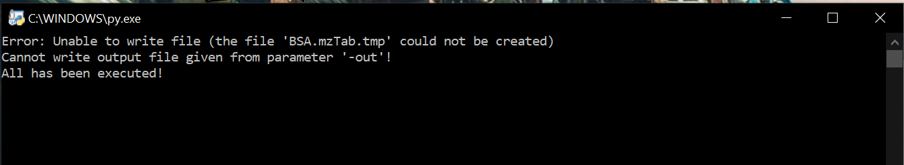

# Woche 10

1. Arbeitet eventuelle Rückstände auf:
    - Drag and Drop für die Configview wurde eingefügt
    - In der Configview sind nun buttons eingefügt worden, die Items zur Itemliste 
    hinzufügen.
    

2. Neues:
    - Run Menü wurde hinzugefügt. In diesem gibt es die Option über das Terminal welches die Final Box.py laufen lässt einen Befehl auszuführen.
     Momentan wird erstmal nur der Beispiel Code aus dem Wochenplan 10 hardcoded ausgeführt.
3. Probleme:
    - der Befehl erzeugt noch einen Fehler(noch keine Lösung gefunden)
    
    - bisher nur auf Windows getestet
