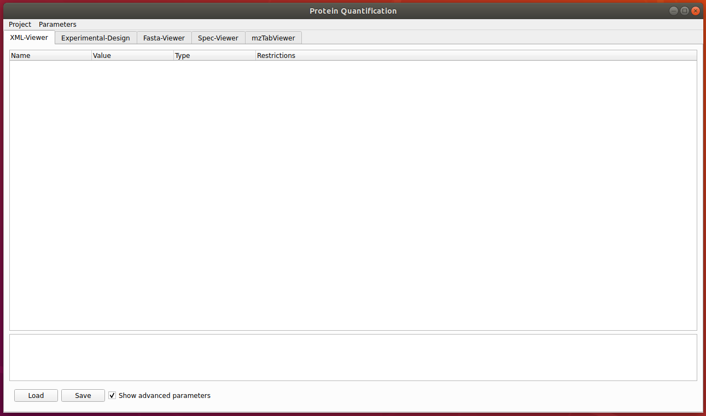
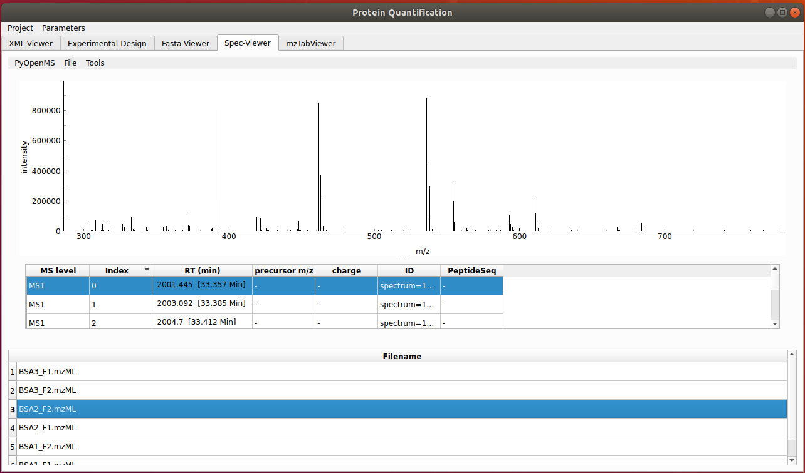
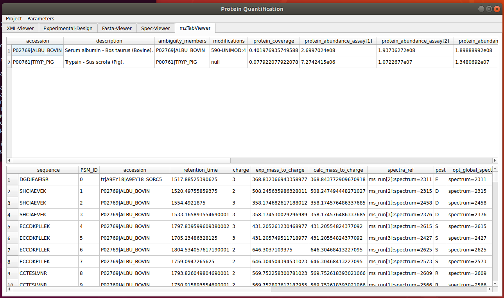

# Woche 11

1. Main App:

    - Die App wurde weiter verbessert und es gibt nun mehr optionen in der Menüleiste.
        - Parameter:
            - Threads (default 1), FDR (default 0.3)
        - Project:
            - Load, Save, Run

    

    - Mithilfe von Load wird ein Ordner als Projekt geöffnet und der Ordner durchsucht nach benötigten Dateien. Diesee Funktion soll dem Benutzer die Möglichkeit
    geben alle benötigten Dateien mit einem Befehl reinzuladen.
        - .tsv als experimental design falls keins vohanden ist wird der Ordner nach mzML Dateien durchsucht
        und diese werden dann in das experimental design reingeladen.
        - .ini als configdatei
        - .fasta als Referenz Datenbank
        - Falls irgendeine Datei fehlt wird der entsprechende Tab leer gelassen
        - .mzML werden im SpecView als Liste angezeigt und durch auswahl kann ein Spektrum angezeigt werden

    

    - Save lässt den user die dateien speichern, gewählt wird ein Ordner in dem die beiden wichtigen dateien gespeichert werden (.tsv, .ini)
        - fasta wird nicht gespeichert, da das widget nur zur visualisierung genutzt wird.

    - Run lässt den user das Processing ausführen:
        - Als referenz datenbank wird die fasta gewählt welche in der app geladen ist, das gleiche gilt für die configdatei.
        - Das experimental layout dient als referenz welche daten prozessiert werden als input und auch als design
        - Die erzeugte mzTab Datei wird dann in dem mzTabTableWidget angezeigt.

    

2. mzMLTableWidget:

    - Das gegebene BSA_Design.tsv template wurde so verändert dass die letzten 4 zeilen gelöscht wurden (extra columns) um das parsen nicht zu stören
        - Extrafälle wie diese müssen noch beachtet werden
    - Fehler beim laden der Tabelle wurde behoben (indexierung der Tabelle wurde von uns gewählt aber ist nicht vorhanden in den gegebenen .tsv dateien)
    - Kleine refactorings um das arbeiten mit dem Widget zu erleichtern

3. ConfigViewWidget:

    - kleine refactorings um das arbeiten mit dem Widget zu erleichtern

4. Probleme:
